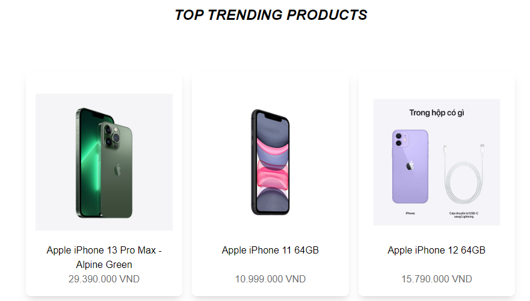

# React Admin Dashboard

Link Website:https://admin-commerce-three.vercel.app

Introduce:
Admin Dashboard displays information about customers, products, and orders. At the same time, visually display parameter reports from the database.
Below is an image of the functionality in the application
+Product Manage Include Add, Edit, Delete

+Dashboard: total product, order, customer, transaction

+Customer Manage Include Add, Edit, Delete
+Transaction Manage Include Add, Edit, Delete

=> pacckage

- Create react app
- Axios
- ChatJS
- React-Router-Dom
- Mui Material

* Author: Nguyễn Tố Bình
* Contact: Linkedle
