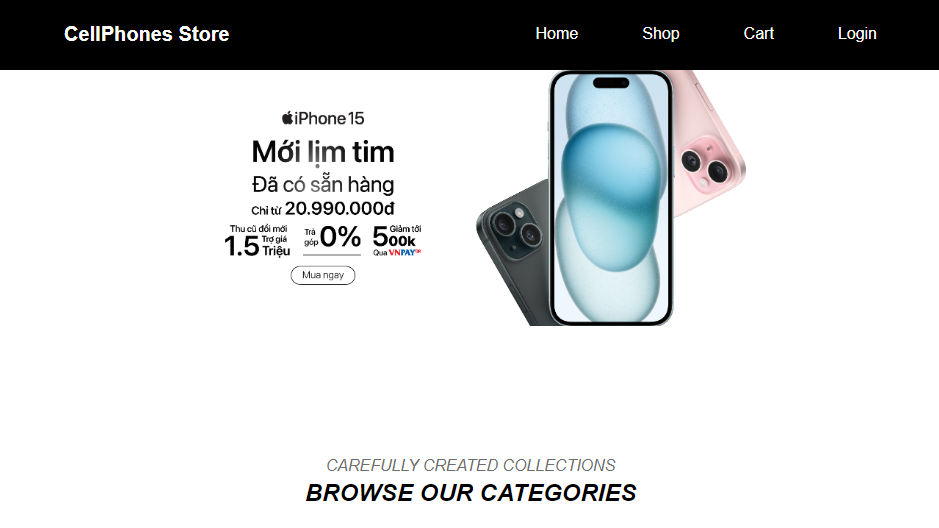
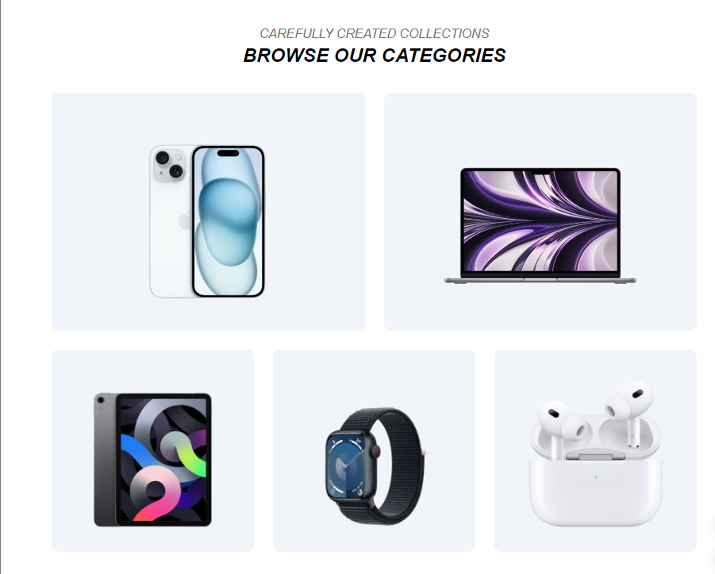

# React Ecommerce Application

This is ass3 creating an e-commerce sales web application in Funix's FullStack Developer course.

The application consists of 2 parts and is saved in 3 branches of the project:
+FrondEnd: Client and Admin
+BackEnd: Server
I already created fronten-back in branch github, so that you can check and try them
Below is detailed information about the client frontend
Website Link:https://client-commerce.vercel.app/

Introduce:
Client FrontEnd includes pages such as Home, Shop, Shopping Cart, Login & Register, Order Information. Along with that are basic functions such as: adding products to cart, making payments and viewing transaction history.

Photo of web application:

=> package use in this project

- Vites
- Axios
- React-Router-Dom
- React-Redux
- Flowbite-React

* Author: Nguyen To Binh
* Contact: Linkedle
